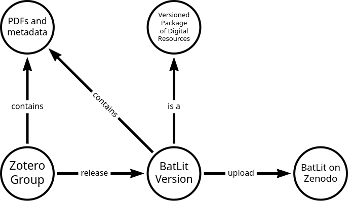

## Contact Us

[batlitproject@gmail.com](mailto:batlitproject@gmail.com)

## [GBatNet Eco-Interactions Working Group](https://www.gbatnet.org/interdisciplinary-projects/#eco-interactions)

The Global Union of Bat Diversity Networks (GBatNet) is the network of bat networks (and affiliated organizations) that are involved in exploring complementary aspects of bats to facilitate and enhance research addressing bat diversification and sustainability. 

## Data Paper

BatLit is an actively managed, digital, versioned, and citable collection of bat research literature and associated metadata compiled from existing literature contributed by bat researchers. BatLit is designed to be used in manual (e.g., point-and-click) as well as automated workflows (e.g., text mining, language model training), and can be accessed in many ways, including, but not limited to, external storage media, Zenodo, and GitHub.  

[https://batlit.org/datapaper](https://batlit.org/datapaper)

## Workflow for Bat Literature Repository Project 

