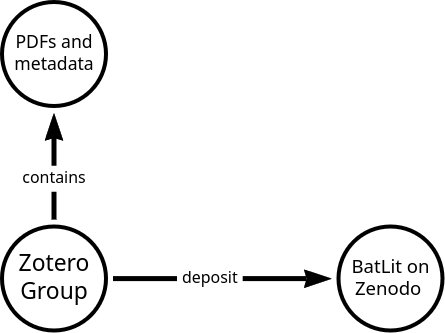

⚠️ this is a work in progress⚠️

[suggest page edits](https://github.com/bat-literature/bat-literature.github.io/edit/main/datapaper.md) / [share feedback](https://github.com/bat-literature/bat-literature.github.io/issues/new)

[Introduction](#introduction) / [Methods](#methods) / [Prerequisites](#prerequisites) / [Results](#results) / [Discussion](#Discussion) / [Reference List](refs)

## Introduction

Bat researchers rely on access to a vast corpus of bat literature to help advance our understanding of bats and the ecosystems they live in. Many researchers build and organize their personal literature collections using mainstream digital tools like Zotero and EndNote, whereas others use homegrown digital methods or even manage their collections manually. However, all researchers routinely encounter roadblocks to literature access including paywalls and older literature resources that have not yet been digitized.  To help provide access to bat research literature for all, [Plazi](https://plazi.org) and the [GBatNet Bat Eco-Interactions Working Group](https://docs.google.com/document/d/1yvOZVzv4hnr4E0p_0cNuISyF6c5Gd2Dvps_He9cwOBg/edit#heading=h.7i02bj7q2tld) are compiling the Bat Literature Corpus (BatLit). BatLit is an actively managed, digital, versioned, and citable collection of bat research literature and associated metadata compiled from existing literature contributed by bat researchers. BatLit is designed to be used in manual (e.g., point-and-click) as well as automated workflows (e.g., text mining, language model training), and can be accessed in many ways, including, but not limited to, external storage media, Zenodo, and GitHub. As BatLit continues to improve and grow, we aim to continue to democratize access to bat literature, accelerate research, and help reduce the barrier to knowledge for bat researchers around the world. We invite you to contribute your reference library, especially the PDFs, to BatLit and thereby help increase information access for all.

<b>The Bat Literature Project (BatLit) facilitates discovery of scientific literature on bats (Chiroptera).</b> 

For more information contact Aja Sherman ([aja.sherman22@gmail.com](mailto:aja.sherman22@gmail.com)), Cullen Geiselman ([cullen@werinterests.com](mailto:cullen@werinterests.com)), or Jorrit Poelen ([jhpoelen@jhpoelen.nl](mailto:jhpoelen+batlit@jhpoelen.nl)).

Cite as:




## Getting Started

If you'd like to explore BatLit, please review the examples below. Alternatively, if you'd like to learn more about why BatLit exists, and how it was built, please skip to the [`Introduction`](#introduction).

### Searching for Literature by Keywords 

One way BatLit can be searched and discovered is through Zenodo at [https://zenodo.org/communities/batlit](https://zenodo.org/communities/batlit). Zenodo offers search features through a point-and-click web interface, as well as a Web Application Programming Interface (Web API, [https://developers.zenodo.org](https://developers.zenodo.org)).   

For instance, let's say that Carla would like to search for literature that mention "Rhinolophus sinicus" in their associated metadata (e.g., title, abstract). She uses Zenodo and enters "Rhinolophus sinicus" in the search box of the BatLit community producing the following query: [https://zenodo.org/communities/batlit/records?q=rhinolophus%20sinicus](https://zenodo.org/communities/batlit/records?q=rhinolophus%20sinicus) . On inspecting the initial results, she limits to see only publications that are openly available by selecting `Access Status > Open` in the Zenodo web search results. 

[](https://zenodo.org/communities/batlit/records?q=rhinolophus%20sinicus)

[](https://zenodo.org/communities/batlit/records?q=rhinolophus%20sinicus)

### Searching by Zotero Record Identifiers

BatLit is managed as a [Group Library in Zotero](https://www.zotero.org/groups/5435545/bat_literature_project/). Each Zotero record has a group id and an item id. These ids uniquely identify a record. These ids are combined to create a life science identifier for each Zotero literature record with the following syntax:

```
urn:lsid:zotero.org:groups:[group id]:items:[item id]
```

For example, the Zotero record with group id `5435545` (the batlit group) and item id `C4GD9Y6Q` has a lsid:

```
urn:lsid:zotero.org:groups:5435545:items:C4GD9Y6Q
```

Now, you can search Zenodo for deposits (publications) related to this particular Zotero record by putting the lsid (in double quotes) in the search box. After hitting "enter", you are directed to the following [search results page](https://zenodo.org/communities/batlit/records?q=%22urn%3Alsid%3Azotero.org%3Agroups%3A5435545%3Aitems%3AC4GD9Y6Q%22) .  

[](https://zenodo.org/communities/batlit/records?q=%22urn%3Alsid%3Azotero.org%3Agroups%3A5435545%3Aitems%3AC4GD9Y6Q%22)

The example above shows that BatLit records in Zotero are linked to their derived records in Zenodo by their record identifiers.

### More Advanced Queries

Because BatLit is integrated with Zenodo, you can benefit from the powerful features of the Zenodo Web Search and Zenodo Web API for discovery. See [https://developers.zenodo.org](https://developers.zenodo.org) for more information.  

## Contributing

If you have any comments, suggestions, or questions, please open [an issue](https://github.com/bat-literature/bat-literature.github.io/issues/new). 

## Version History

 | name | version | date | size | # pages | # references | # attachments | fingerprint |
 | --- | --- | --- | --- | --- | --- | --- | --- |
 | Bat Literature Corpus | v0.1 | 2024-04-26 | 7.9 GiB | | 2929 | 5055 | [hash://sha256/6ba...189](https://linker.bio/hash://sha256/6ba3d79cf1fd6349012cb4e527b6727b3e41e140489fa9c02f132e2cdd88d189) |  
 | Bat Literature Corpus | v0.2 | 2024-05-16/2024-05-17 | 11.6 GiB | | 3310 | 5471 | [hash://md5/be6...1d7](https://linker.bio/hash://md5/be692b93a8edde4c4269be9e7d4ec1d7) |  
 | Bat Literature Corpus | v0.3 | 2024-06-25/2024-06-26 | 13.6 GiB | | 5501 | 7229 | [hash://md5/350...77d](https://linker.bio/hash://md5/350f87ae6b68b96bec135c1d6ebac77d) |  
 | Bat Literature Corpus | v0.4 | 2024-08-01/2024-08-02 | 50.9 GiB | | 20146 | 29860 | [hash://md5/b39...72a](https://linker.bio/hash://md5/b394bdb081f55916b1226b5bc8ba972a) |  
 | Bat Literature Corpus | v0.5 | 2024-08-16/2024-08-17 | 50.9 GiB | | 20145 | 29850 | [hash://md5/26f...b20](https://linker.bio/hash://md5/26f7ce5dd404e33c6570edd4ba250d20) |  
 | Bat Literature Corpus | v0.6 | 2024-09-19/2024-09-20 | 44.7GiB | 427105 | 19038 | 22590 | [hash://md5/db7...97b](https://linker.bio/hash://md5/db73e659e8cf16ef50e82bb5e72ae97b) |  
 | Bat Literature Corpus | v0.7 | 2024-12-05/2024-12-06 | 45.2GiB | 431870 | 19268 | 22930 | [hash://md5/ce1...1a3](https://linker.bio/hash://md5/ce1e7618f237ff56e74d51f496e811a3) |  

## Methods

We use [Zotero]([https://zotero.org](https://www.zotero.org/groups/5435545/bat_literature_project/)) for managing our literature corpus, and [Preston](https://github.com/bio-guoda/preston) for tracking their associated content in a versioned corpus. This versioned corpus is designed to be published through Zenodo.



The above figure shows how Zotero is used for managing a collection of literature references (pdfs and metadata). Versioned snapshots of this collection are securely packaged as a BatLit version. This version is then mobilized using the [Zenodo BatLit community](https://zenodo.org/communities/batlit).


### Curation Workflow

To help keep BatLit current (e.g., add new references) and accurate (e.g., update existing records), we've implemented the following curation workflows: 

#### New References Workflow

1. BatLit community solicits bat literature references and their associated digital copies 
2. provided literature references and digital copies (e.g., pdfs) are reviewed
3. on passing review, literature references are added to BatLit Zotero community by the BatLit curator

#### Feedback Workflow

1. BatLit Community Solicits feedback on published BatLit versions
2. on receiving feedback, the batlit curator documents the request in [a github issue](https://github.com/bat-literature/bat-literature.github.io/issues) at https://github.com/bat-literature/bat-literature.github.io/issues .
3. [open issues](https://github.com/bat-literature/bat-literature.github.io/issues) are reviewed by the editorial board under guidance of the curator
4. if needed, existing records are updated to address the provided issue

#### Deduplication Workflow

1. Data curator merges duplicate entries entries using the Zotero merge tool
2. Data archivist take a versioned snapshot of the Zotero group
3. Preston (or some other robot) detects relations like:

```json
{ 
 "...": "...",
"key": "YWNCWPYJ",
 "...": "...",
"relations": {
            "dc:replaces": "http://zotero.org/groups/5435545/items/2PWXAVQL"
        }
 "...": "...",
}
```
and translates this into an action to annotate any existing Zenodo record associated with http://zotero.org/groups/5435545/items/2PWXAVQL (or urn:lsid:zotero.org:groups:5435545:items:2PWXAVQL)
 as deprecated and being replaced by https://www.zotero.org/groups/5435545/items/YWNCWPYJ (or urn:lsid:zotero.org:groups:5435545:items:YWNCWPYJ), or

```
(urn:lsid:zotero.org:groups:5435545:items:2PWXAVQL) 
  -[:replaced_by]-> 
    (urn:lsid:zotero.org:groups:5435545:items:YWNCWPYJ)
```

For context see notes related to [`approach curating duplicate literature entries`](https://github.com/bat-literature/bat-literature.github.io/issues/6).

### Prerequisites

In the following sections, some examples are listed that uses a notation commonly used in the [Unix shell](https://librarycarpentry.org/lc-shell/), also known as the "commandline" or "terminal". And, at the time of writing, these examples can be executed/run provided the following programs are available: [preston](https://github.com/bio-guoda/preston), [jq](https://jqlang.github.io/jq/), [mlr](https://miller.readthedocs.io/en/6.12.0/) as well as more commonly available unix/posix/linux programs like [grep](https://en.wikipedia.org/wiki/Grep), [sort](https://en.wikipedia.org/wiki/Sort_(Unix)), and [uniq](https://en.wikipedia.org/wiki/Uniq). 

To run these programs, please use some Linux distribution, MacOS, or [Windows Subsystem for Linux](https://en.wikipedia.org/wiki/Windows_Subsystem_for_Linux) (WSL) available on Windows 10 and higher. 

Also, please make sure to install [preston](https://github.com/bio-guoda/preston#quickstart), [jq](https://jqlang.github.io/jq/), and [mlr](https://miller.readthedocs.io/en/6.12.0/).  

The tools used in the example workflows are designed to handle lots of data quickly using so-called ["Standard Streams"](https://en.wikipedia.org/wiki/Standard_streams). In addition, they have the ability to run offline after an initial caching (or cloning) of remote resources. If you are unfamiliar with these tools or processing methods and would like to learn more, you may benefit from a Carpentries Lesson like https://librarycarpentry.org/lc-shell/ or many of the other educational materials. Note that some of these tools have been around since the 1970s, are well documented and are likely to stick around a little while longer.  

### Tracking Zotero 

To track the Zotero group and compile a version of the bat literature corpus, the following command is used (in bash/linux):

```bash
ZOTERO_TOKEN=[SECRET] preston track --algo md5 https://www.zotero.org/groups/5435545/bat_literature_project
```

Note that this group has access restrictions for copyright reasons. This is why you need to replace the "[SECRET]" with your personal access token.

### Publishing Metadata

To publish the batlit metadata only (not pdfs), use the following commands

```
# first copy provenance index
preston cp --algo md5 --type provindex [target dir]/data

# then copy the provenance 
preston cp --algo md5 --type prov [target dir]/data

cd [target dir]

# and get the associated zotero metadata
preston ls --algo md5\
 | grep -v "file/view"\
 | grep hasVersion\
 | preston cat --algo md5 --remote file://[source dir]/data\
 > /dev/null
```

### Depositing To Zenodo

BatLit content and metadata is made available through Zenodo to facilitate access. 

The following workflow can be used to deposit versioned BatLit records into Zenodo: (a) generate Zenodo compatible metadata (b) submit metadata along with their associated pdf using the Zenodo Web API.  

In (a), we convert the tracked Zotero metadata into the Zenodo metadata using [preston zotero-stream]: 

```bash
preston cat $(preston head --algo md5)\
 | preston zotero-stream\
 --anchor $(preston head --algo md5)\
 --algo md5\
 --communities batlit,biosyslit\
 > zenodo.json
```

where ```zenodo.json``` contains a Zenodo metadata record on each line using the https://jsonlines.org/ format. 

An example a single line from such metadata generated from a versioned BatLit corpus, in this case ```BatLit v0.5 hash://md5/26f7ce5dd404e33c6570edd4ba250d20```,  is shown below. 

```json
{
  "metadata": {
    "filename": "Campbell et al. - 2010 - Divergent Microclimates in Artificial and Natural .pdf",
    "related_identifiers": [
      {
        "relation": "isAlternateIdentifier",
        "identifier": "hash://md5/0ed912a0ce156ab17810d732e2b4d13d"
      },
      {
        "relation": "isAlternateIdentifier",
        "identifier": "urn:lsid:zotero.org:groups:5435545:items:IJI9WGI5"
      },
      {
        "relation": "hasVersion",
        "identifier": "hash://md5/0ed912a0ce156ab17810d732e2b4d13d"
      },
      {
        "relation": "hasVersion",
        "identifier": "hash://sha256/6b55ec617db5023a663d31dbd016f609398bf5a45991b544f240d6fb84d93779"
      },
      {
        "relation": "isDerivedFrom",
        "identifier": "zotero://select/groups/5435545/items/IJI9WGI5"
      },
      {
        "relation": "isDerivedFrom",
        "identifier": "https://zotero.org/groups/5435545/items/IJI9WGI5"
      },
      {
        "relation": "isDerivedFrom",
        "identifier": "https://linker.bio/cut:hash://md5/2717614e0b13ca488fb57c2ee6c64f2e!/b147656-150219"
      },
      {
        "relation": "isPartOf",
        "identifier": "hash://md5/26f7ce5dd404e33c6570edd4ba250d20"
      },
      {
        "relation": "isAlternateIdentifier",
        "identifier": "10.3161/150811010X504671"
      },
      {
        "relation": "isCompiledBy",
        "identifier": "10.5281/zenodo.1410543",
        "resource_type": "software"
      }
    ],
    "communities": [
      {
        "identifier": "batlit"
      },
      {
        "identifier": "biosyslit"
      }
    ],
    "http://www.w3.org/ns/prov#wasDerivedFrom": "https://linker.bio/cut:hash://md5/2717614e0b13ca488fb57c2ee6c64f2e!/b147656-150219",
    "upload_type": "publication",
    "http://www.w3.org/1999/02/22-rdf-syntax-ns#type": "application/json",
    "referenceId": "https://api.zotero.org/groups/5435545/items/IJI9WGI5",
    "creators": [
      {
        "name": "Campbell, Susan"
      },
      {
        "name": "Coulson, Graeme"
      },
      {
        "name": "Lumsden, Linda F."
      }
    ],
    "publication_type": "article",
    "access_right": "restricted",
    "publication_date": "2010",
    "title": "Divergent microclimates in artificial and natural roosts of the large-footed myotis (Myotis macropus)",
    "journal_title": "Acta Chiropterologica",
    "journal_volume": "12",
    "journal_issue": "1",
    "journal_pages": "173-185",
    "keywords": [
      "Biodiversity",
      "Mammalia",
      "Chiroptera",
      "Chordata",
      "Animalia",
      "bats",
      "bat"
    ],
    "custom": {
      "dwc:kingdom": [
        "Animalia"
      ],
      "dwc:phylum": [
        "Chordata"
      ],
      "dwc:class": [
        "Mammalia"
      ],
      "dwc:order": [
        "Chiroptera"
      ]
    },
    "description": "(Uploaded by Plazi for the Bat Literature Project) The thermal environment of day roosts is considered one of the most influential factors affecting the survival, growth and reproduction of microbats. The use of torpor is a common energy saving strategy employed by microbats in temperate regions. The efficiency of entry into, and arousal from, torpor is governed by roost microclimate, primarily roost temperature. The large-footed myotis Myotis macropus roosts in both tree cavities and a man-made tunnel at Yan Yean reservoir in Victoria, Australia. We investigated the thermal properties of both roost types in comparison to available tree cavities and ambient temperature over four time periods from October 2003 to May 2005. Tree cavities and tunnel roosts remained significantly warmer at night, cooler during the day, and were more stable than ambient temperatures. In addition, roost tree cavities were significantly cooler between 10:00–13:00 h compared to available tree cavities, and there was a trend for roost tree cavities to be slightly warmer at night and slower to reach maximum temperature relative to available tree cavities during the breeding season (October–January). In contrast, there was little difference in roost and available tree cavity temperatures outside of the breeding season (April–May). Temperatures inside tunnel roosts were more stable and were significantly cooler during the afternoon compared to roost tree cavities during both the breeding and non-breeding seasons. Myotis macropus may actively trade-off the enhanced thermoregulatory benefits of warm roosts for reduced predation risk associated with the tunnel roosting environment."
  }
}
```

Now, after generating the metadata, in (b), we deposit the records into the desired Zenodo community after tracking their version:

```bash
cat zenodo.json\
 | preston track --algo md5\
 | ZENODO_TOKEN=[SECRET] preston zenodo --algo md5 --communities batlit,biosyslit\
 1> transfer.nq\
 2> transfer.err
```

where ```transfer.nq``` captures the responses from Zenodo following the submission of the records, and ```transfer.err``` contains the error logs related to the submission of the record.

Please refer to --help pages for [preston zenodo] for more information on ways to update metadata, force new versions etc. 

:warning: please use the https://sandbox.zenodo.org to test record submission workflows before using the production endpoint at https://zenodo.org . :warning: 

### Verifying Access to BatLit Content

The internet is a dynamic place, and content gets destroyed, damaged, lost, or misplaced, even in large, trusted infrastructures. 

In order to verify whether BatLit content is available on Zenodo (or elsewhere), the following procedure can be used to check whether BatLit associated content can be found, accessed, integrated, and reused:

```
export ZENODO_TOKEN=[SECRET]
# ^^^^
# needed only to access restricted content

preston verify\
 --algo md5\
 --remote https://batlit.org/data,https://zenodo.org\
 --anchor hash://md5/db73e659e8cf16ef50e82bb5e72ae97b
```

where

```
preston verify
```

is the command that goes through the inventory of BatLit Corpus, and attempts to retrieve content from https://batlit.org first (metadata), then from Zenodo (pdfs) unless the content is already available locally.

Note that

```
--anchor hash://md5/db73e659e8cf16ef50e82bb5e72ae97b
```

specifies the fingerprint of the version you'd like to verify. In this case the fingerprint refers to BatLit Corpus v0.6 . 

In other words, a method exists to help periodically verify that BatLit related content is accessible. The workflow shown above is the equivalent of clicking on all the ~20k download buttons in the BatLit associated Zenodo html pages in addition to checking each and every entry in BatLit Corpus for a corresponding content.

#### Note on BatLit content in Zenodo

Note that after submission of Zenodo-compatible (at least at time of writing) metadata generated from a specific batlit version, Zenodo software or community editors, may choose to reformat, or otherwise change, the metadata associated with a submitted record at some point in the future. Due to Zenodo's design, record metadata is *not* version controlled and may change in the future and deviate from their original, immutable, BatLit version. In other words, BatLit associated content on Zenodo should be considered as a possibly incomplete or changed copy of the content associated with an original BatLit version. This is why it is recommended to use (or at least cite) the original batlit corpus when using the corpus for research purposes or automated workflows. 


### Statistics

Estimating number of references in a corpus version - 

```
preston cat --remote https://linker.bio hash://md5/ce1e7618f237ff56e74d51f496e811a3\
 | grep "items[?]"\
 | grep hasVersion\
 | preston cat --remote https://linker.bio\
 | jq -c '.[]'\
 | jq --raw-output -c '.data | select(has("creators"))'\
 | wc -l
```

Estimating number of associated corpus pdfs - 

```
preston cat --remote https://linker.bio hash://md5/ce1e7618f237ff56e74d51f496e811a3\
 | grep "file/view"\
 | grep hasVersion\
 | grep hash\
 | wc -l
```

Estimating the total volume of data for the most recent (i.e. "head") version

```
preston cat --remote https://linker.bio hash://md5/ce1e7618f237ff56e74d51f496e811a3\
 | grep hasVersion\
 | grep -oE "hash://md5/[a-f0-9]{32}"\
 | sort\
 | uniq\
 | preston cat\
 | pv > /dev/null
```

## Results

### Example of Tracked Zotero Record
An example of a tracked Zotero record generated using

```bash
preston cat --remote https://linker.bio hash://md5/ce1e7618f237ff56e74d51f496e811a3\
 | grep "items[?]"\
 | grep hasVersion\
 | preston cat --remote https://linker.bio\
 | jq -c '.[]'\
 | head -n1\
 | jq .
```


 is shown below:

```json 
{
  "key": "376ZATI8",
  "version": 62023,
  "library": {
    "type": "group",
    "id": 5435545,
    "name": "Bat Literature Project",
    "links": {
      "alternate": {
        "href": "https://www.zotero.org/groups/bat_literature_project",
        "type": "text/html"
      }
    }
  },
  "links": {
    "self": {
      "href": "https://api.zotero.org/groups/5435545/items/376ZATI8",
      "type": "application/json"
    },
    "alternate": {
      "href": "https://www.zotero.org/groups/bat_literature_project/items/376ZATI8",
      "type": "text/html"
    },
    "attachment": {
      "href": "https://api.zotero.org/groups/5435545/items/5PUDTPS6",
      "type": "application/json",
      "attachmentType": "application/pdf",
      "attachmentSize": 1407714
    }
  },
  "meta": {
    "createdByUser": {
      "id": 13229919,
      "username": "acsherman",
      "name": "",
      "links": {
        "alternate": {
          "href": "https://www.zotero.org/acsherman",
          "type": "text/html"
        }
      }
    },
    "creatorSummary": "Guillen-Servent et al.",
    "parsedDate": "2003",
    "numChildren": 1
  },
  "data": {
    "key": "376ZATI8",
    "version": 62023,
    "itemType": "bookSection",
    "title": "Phylogeography and biogeography of the horseshoe bats (Chiroptera: Rhinolophidae)",
    "creators": [
      {
        "creatorType": "author",
        "firstName": "A.",
        "lastName": "Guillen-Servent"
      },
      {
        "creatorType": "author",
        "firstName": "C. M.",
        "lastName": "Francis"
      },
      {
        "creatorType": "author",
        "firstName": "",
        "lastName": "Ricklefs, Robert E."
      }
    ],
    "abstractNote": "",
    "bookTitle": "Horseshoe bats of the World (Chiroptera: Rhinolophidae) Shropshire",
    "series": "",
    "seriesNumber": "",
    "volume": "",
    "numberOfVolumes": "",
    "edition": "",
    "place": "Shropshire",
    "publisher": "Alana Books",
    "date": "2003",
    "pages": "",
    "language": "",
    "ISBN": "",
    "shortTitle": "",
    "url": "",
    "accessDate": "",
    "archive": "",
    "archiveLocation": "",
    "libraryCatalog": "",
    "callNumber": "",
    "rights": "",
    "extra": "",
    "tags": [],
    "collections": [
      "UAWY6DNP"
    ],
    "relations": {},
    "dateAdded": "2024-12-05T16:49:47Z",
    "dateModified": "2024-12-05T16:52:11Z"
  }
}
```

### Literature Records by Type

The tracked metadata was used to list the kinds of content included in the Bat Literature Corpus. 

The follow bash script was used to generated the content type frequency table below.

```bash
cat\
 <(echo count contentType)\
 <(preston cat --remote https://linker.bio hash://md5/ce1e7618f237ff56e74d51f496e811a3 | grep items? | grep hasVersion | preston cat --remote https://linker.bio | jq --raw-output '.[].data.itemType' | sort | uniq -c | sort -nr)\
 | mlr --ipprint --omd cat 
```

Note that there's roughly two kinds of content: top level content like journal articles, books, reports and conference papers. These top level content may have one of more association with associated content like attachments, notes, and annotations. These types are provided by Zotero. You can find background on these contentTypes (aka item types) at https://www.zotero.org/support/kb/item_types_and_fields .  

| count | contentType |
| --- | --- |
| 24175 | attachment |
| 18373 | journalArticle |
| 637 | note |
| 360 | book |
| 282 | bookSection |
| 99 | report |
| 95 | annotation |
| 54 | thesis |
| 34 | conferencePaper |
| 28 | preprint |
| 15 | dataset |
| 14 | magazineArticle |
| 6 | webpage |
| 2 | newspaperArticle |
| 1 | presentation |

### Literature Record Index

Literature records can be extracted from this corpus in various ways. As an example, we show the output of an executed script in [bin/list-refs.sh](bin/list-refs.sh) against a recent version of the BatLit Corpus. For ease of processing, we've included a sample of 3 records in the table below, as well as files in tsv/csv formats include 100 records and all records.

| filenames | description |
| --- | --- |
| [refs-100.tsv](refs-100.tsv) / [refs-100.csv](refs-100.csv) | author/date/title/journal of first 100 records
| [refs.tsv](refs.tsv) / [refs.csv](refs.csv) | author/date/title/journal of all records

First 3 records shown below as an example. This data is also used to create the [BatLit References Page](refs). This page adds links to the references to facilitate searches on Zenodo.

Note that ```id``` points to the records as seen on Zotero, ```attachment``` points to the attachment records as seen on Zotero, ```attachmentId``` is the signature/hash of the associated pdf, ```corpusId``` is the signature/hash of the applicable [BatLit version](#version-history). 

```
authors      Douglas
date         1967
title        Article: The Natural History of the Ghost Bat, Macroderma Gigas (Microchiroptera Megadermatidae), in Western Australia
journal      Western Australia. The Western Australian Naturalist
type         journalArticle
volume       10
issue        
pages        125-138
doi          
id           https://www.zotero.org/groups/bat_literature_project/items/M5MZ6NSB
attachment   https://api.zotero.org/groups/5435545/items/223GU789
attachmentId hash://md5/5e3f7fac483550be7983c6096e9e9800
corpusId     hash://md5/ce1e7618f237ff56e74d51f496e811a3

authors      Vora | Hannah | Lieberman | Vale | Plowright | Bernstein
date         2022-05
title        Want to prevent pandemics? Stop spillovers
journal      Nature
type         journalArticle
volume       605
issue        7910
pages        419-422
doi          10.1038/d41586-022-01312-y
id           https://www.zotero.org/groups/bat_literature_project/items/A5RNP5YH
attachment   https://api.zotero.org/groups/5435545/items/223P42N5
attachmentId hash://md5/85c89cedcc23b072f98f3c22ad731029
corpusId     hash://md5/ce1e7618f237ff56e74d51f496e811a3

authors      Otto | Rall | Brose
date         12/2007
title        Allometric degree distributions facilitate food-web stability
journal      Nature
type         journalArticle
volume       450
issue        7173
pages        1226-1229
doi          10.1038/nature06359
id           https://www.zotero.org/groups/bat_literature_project/items/6RAB386Y
attachment   https://api.zotero.org/groups/5435545/items/225DJR2Q
attachmentId hash://md5/6bdc818006c01cac3dd90eec4b337289
corpusId     hash://md5/ce1e7618f237ff56e74d51f496e811a3
```

## Discussion
