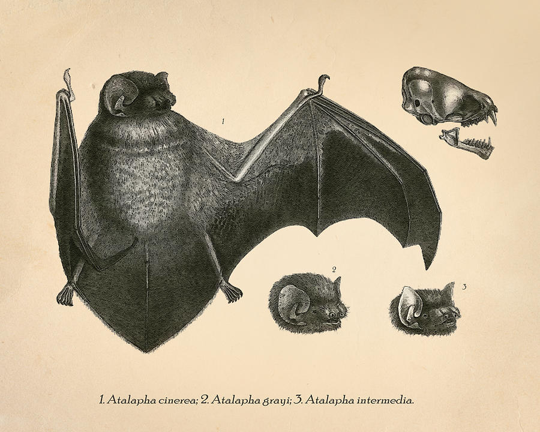

## The Project

Bat researchers worldwide contribute to and rely on a vast corpus of literature to build our collective scientific knowledge. Yet in practice, researchers’ engagement with literature is a solo endeavor, creating personal archives of paper copies or PDFs. Rather than the scientific literature being widely and publicly available, researchers employ tedious and expensive methods to find new sources such as scanning bibliographies or using subscription-based search tools. 
To address this, Plazi and the GBatNet Bat Eco-Interactions Working Group launched the **Bat Literature Project (BatLit)**—a freely available, versioned, multilingual, and citable digital archive of bat research and bibliographic metadata. BatLit is hosted on **Zenodo**, providing stable, open access to over 20,000 publications contributed by the global bat research community.

We invite you to join the Community, contribute your literature, and help build and promote the world’s largest shared bat science archive.

## Cite As: 


