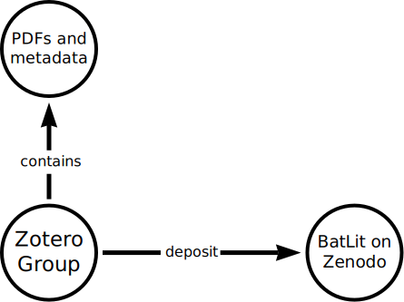

---
author:
  - Jorrit Poelen (UC Santa Barbara Cheadle Center, Ronin Institute, GloBI)
title: "Mobilizing Bat Literature"
subtitle: "using versioned snapshots of the Zotero BatLit Library"
date: 2025-08-26
aspectratio: 169
---

## Guiding Questions

### How to manage the BatLit corpus?

### How to create versioned snapshots of the BatLit corpus?

### How to share versioned snapshots of the BatLit corpus?

## Guiding Questions - Brief Answers 

### How to manage the BatLit corpus?

We use [Zotero](https://zotero.com) to manage our literature corpus.

### How to create versioned snapshots of the BatLit corpus?

We use Preston to version our literature corpus ^[Elliott M.J., Poelen, J.H. & Fortes, J.A.B. (2023) Signing data citations enables data verification and citation persistence. *Sci Data*. https://doi.org/10.1038/s41597-023-02230-y [hash://sha256/f849c870565f608899f183ca261365dce9c9f1c5441b1c779e0db49df9c2a19d](https://linker.bio/hash://sha256/f849c870565f608899f183ca261365dce9c9f1c5441b1c779e0db49df9c2a19d)].

### How to share versioned snapshots of the BatLit corpus?

We use [Zenodo](https://zenodo.org) to allow versioned access to BatLit.

## Guiding Questions - More Complete Answers

The [BatLit Data Paper](datapaper) describes our BatLit workflow and provides specific examples. 

Also, the paper relies on Zotero and Zenodo documentation to answer any questions about these platforms. 

The following sections help you get started on Preston and their relation to Zotero and Zenodo.

## BatLit Publication Workflow 

 

## Why Preston? 

Preston allows for creating a versioned snapshot of a Zotero library (or group). 

Also, Preston allows for depositing this versioned snapshot into Zenodo. 

At time of writing, 26 Aug 2025, this publish Zotero-to-Zenodo functionality only offered through Preston. 

## Preston Basics

1. Tracks (or versions) *Digital* Content
2. Format Agnostic (*any* Digital Content)
3. Allows Signed Data Citations

## Prequisites

1. Familiarity with [Unix Shell](https://librarycarpentry.org/lc-shell/)
2. Access to a computer with some Unix Shell
3. Install Preston ^[https://globalbioticinteractions.org/preston]

## Check Preston Version

run 

```bash
preston --version
```

and verify that this produces something like:

```
0.11.0
```

## Say Hi and Version It

Copy and paste this into your commandline.

```
mkdir -p some/empty-directory
cd some/empty-directory
echo hi there! | preston track --algo md5 | grep hasVersion | preston cat 
```

which should produce...

```
hey there!
```

## Say Hi and Version It - Step 1

```
echo hi there!
```

Prints "hi there!" to standard output

## Say Hi and Version It - Step 2

```
echo hi there! | preston track --algo md5
```

Print "hi there!" to output (stdout), then turn this output into input (stdin) of `preston track`. So, this sends "hi there!" to preston and versions (or tracks) the input. The output of preston is a machine readable description of what happened and ends with something like:

```
<...> <...hasVersion> <hash://md5/75c7e31591354f2c82226aa3eb0267c7> <...> .
```


This preston output, or description, is formatted in [rdf/nquads](https://www.w3.org/TR/n-quads/) and records what content was recorded when and by who. This machine readable description is also known as the BOM Bill of Materials, manifest or packing slip for the tracked content.

## Say Hi and Version It - Step 3

```
echo hi there! | preston track --algo md5 | grep hasVersion
```

This prints only the part of the BOM that includes "hasVersion" and should look something like:

```
<urn:uuid:X> <...hasVersion> <hash://md5/75c7e31591354f2c82226aa3eb0267c7> .
```

## Say Hi and Version It - Step 4


```
<urn:uuid:X> <...hasVersion> <hash://md5/75c7e31591354f2c82226aa3eb0267c7> ...
```
This is a statement expressed in rdf/nquad. In this case, it expressed something like: there's this thing ```urn:uuid:X``` that is associated with content that has a cryptographic hash ```hash://md5/75c7e31591354f2c82226aa3eb0267c7```. A cryptographic hash is a unique fingerprint derived from the digital content itself. **If the content and the hash algorithm are the same, the fingerprint is always the same.** This concept is central to internet security as well as things like cryptocurrencies. 

 
## Say Hi and Version It - Step 5

Now, we ask Preston to print the versioned content by piping the "hasVersion" statement into ``preston cat```: 

```
echo hi there! | preston track --algo md5 | grep hasVersion | preston cat
```

to produce . . . 

```
hi there!
```

## Say Hi and Version It - Step 6

Now that we've versioned saying hi, we can print the content using

```
preston cat hash://md5/75c7e31591354f2c82226aa3eb0267c7
```

to produce ...

```
hi there!
```

This suggests that Preston *thinks* that ```hash://md5/75c7e31591354f2c82226aa3eb0267c7``` is the cryptographic hash of ```hi there!```. And . . . 

## Say Hi and Version It - Step 7

If you know the fingerprint of content (e.g., ```hash://md5/75c7e31591354f2c82226aa3eb0267c7```), you can use it to ask for what *exactly* what you want. And, on getting a result, you can *independently* verify that this is the case using some commonly available cryptographic hash calculators like ```md5sum``` (linux) or ```md5``` (Mac). These calculators are readily available as they are central to internet security and other core applications.

## Say Hi and Version It - Step 7 Continued...

```
preston cat hash://md5/75c7e31591354f2c82226aa3eb0267c7 | md5sum
```

produces:

```
75c7e31591354f2c82226aa3eb0267c7  -
```

Showing that an independent tool ```md5sum``` verified that the content you asked for is the content you got!  

## Takeaways

 * Preston tracks, versions and packages digital content
 * Cryptographic hashes are unique digital fingerprints for digital content.
 * Cryptographic hashes can be generated independently using commonly available tools.
 * Cryptographic hashes enable secure citation of digital content

## Next Steps
 
 * Review BatLit Datapaper 
 * Create a Zotero Group for Testing
 * Track the Zotero Test Group using Preston
 * Create a Zenodo Test Community on Zenodo Sandbox 
 * Publish the Zotero Test Group to the Zenodo Test Community
 * Once you feel comfortable, repeat the process with the "real" Zotero BatLit Group and associated Zenodo BatLit Community
